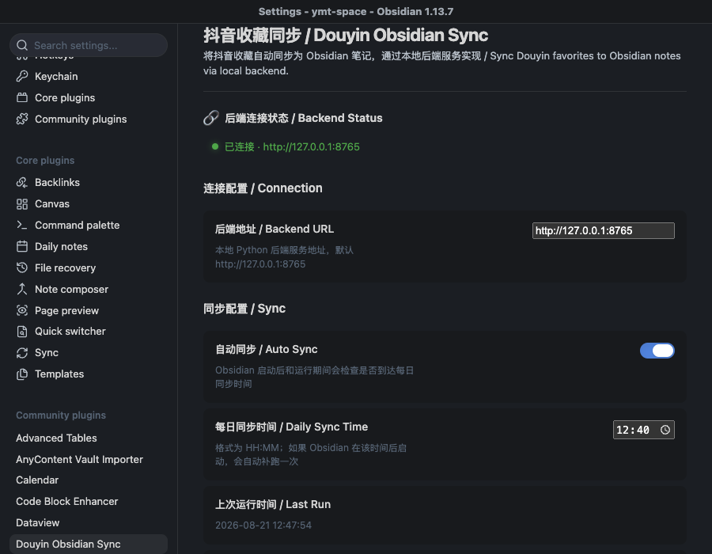
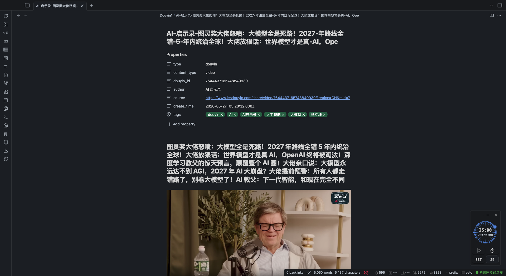

# Douyin Favorites Sync

[中文文档](#中文文档) | [English](#english)

---

## English

Sync your Douyin (抖音) favorites into Obsidian notes — preserving captions, tags, covers, videos, and Whisper transcripts.

> **Backend required**: This plugin communicates with a local Python backend service. Please set up [douyin-favorites-sync-backend](https://github.com/yumingtao/douyin-favorites-sync-backend) first.

### Features

- **Favorites Sync** — Automatically fetch Douyin favorites and batch-import as Obsidian notes
- **Two Modes**
  - ⚡ **Light** — Extract links, covers, and captions only (fast)
  - 🎬 **Heavy** — Download watermark-free videos + Whisper speech transcription
- **Scheduled Sync** — Set a daily sync time; auto-catch-up on Obsidian startup; failed runs retry with exponential backoff (5→60 min, gives up after 8 tries per day)
- **Deduplication** — Skip already-imported content based on `douyin_id` frontmatter
- **Live Status Bar** — Backend connection and sync progress at a glance
- **Web UI Extras** — One-off link extraction and manual import are available in the backend's web UI (open the backend URL in a browser)

> Desktop only — the plugin uses Node.js `fs` to copy video/image attachments into the vault.

### Architecture

```
Obsidian Plugin (TypeScript)          Local Backend (Python/FastAPI)
┌─────────────────────────┐          ┌──────────────────────────┐
│  Ribbon icon / Commands │          │  FastAPI + SQLite        │
│  Settings Tab           │ ◄──────► │  /api/health             │
│  Vault Writer           │  HTTP    │  /api/sync/favorites     │
│  Status Bar             │          │  /api/jobs/extract (job) │
└─────────────────────────┘          │  /api/config/vault       │
                                     │  Web UI (history / auth) │
                                     └──────────────────────────┘
```

### Quick Start

1. **Install the backend** — Follow instructions at [douyin-favorites-sync-backend](https://github.com/yumingtao/douyin-favorites-sync-backend)
2. **Install the plugin** — via Obsidian Community Plugins, or manually:
   - Copy `main.js`, `manifest.json`, `styles.css` into your vault's `.obsidian/plugins/douyin-favorites-sync/` directory
3. **Enable the plugin** in Obsidian Settings → Community Plugins
4. **Configure** — Set backend URL (default `http://127.0.0.1:8765`) and sync options in the settings panel

### Usage

- **Ribbon** — Click the sync icon in the left ribbon to start syncing favorites immediately
- **Status bar** — Shows backend connection state and sync progress at the bottom
- **Command palette** (`Ctrl/Cmd+P`):

| Command | Description |
|---|---|
| 立即同步抖音收藏 | Fetch favorites and import new items now |
| 检查后端连接状态 | Ping the backend (`/api/health`) |

Notes are saved as `<Note Folder>/<author ≤24 chars>-<title ≤56 chars>.md` (duplicates get a `-2` suffix); attachments go to `<Attachment Folder>/<douyin_id>/`.

### Development

```bash
npm install
npm run dev     # Watch mode
npm run build   # Production build → main.js
```

### Note Format

Each Douyin favorite generates a Markdown file (headings in Chinese; Heavy mode embeds the local video file instead of a link):

```markdown
---
type: douyin
content_type: video
douyin_id: "7456789012345"
author: "Author Name"
source: "https://www.douyin.com/video/..."
create_time: "2025-01-01T00:00:00.000Z"
tags:
  - douyin
  - tag1
---

# Note Title

![[attachments/douyin/7456789012345/video.mp4]]   (Heavy mode)
[Watermark-free video link](https://...)          (Light mode)

## 配图


## 文案

Video description text...

## 转写

Whisper speech transcription text...
```

### Configuration

| Setting | Description | Default |
|---------|-------------|---------|
| Backend URL | Local Python backend service address | `http://127.0.0.1:8765` |
| Note Folder | Vault path for Douyin notes | `Douyin` |
| Attachment Folder | Path for video/image attachments | `attachments/douyin` |
| Sync Mode | Light or Heavy | `light` |
| Auto Sync | Enable daily automatic sync | On |
| Daily Sync Time | Format HH:MM | `09:00` |
| Whisper Model | Speech-to-text model for Heavy mode (`tiny` → `large-v3`) | `small` |
| Open Last Note | Auto-open the newest note after a manual sync | Off |
| Extract Delay | Wait between items during Heavy extraction, anti rate-limit (0–60 s) | `10` |

### Security & Filesystem Access

> The Obsidian community review flags a **Direct Filesystem Access** warning because this plugin uses the Node.js `fs` module. Here is exactly what happens:

**What `fs` is used for:**  
A single call to `fs.readFile()` in `src/vaultWriter.ts` reads binary files (video `.mp4`, cover images) from the local backend's download directory into the Obsidian vault.

**Why it's needed:**  
The Obsidian Vault API (`vault.createBinary`, `vault.modifyBinary`) only accepts data that is already inside the Obsidian process. When the Python backend downloads a video to a temp directory (outside the vault), the plugin must use Node.js `fs` to read the binary data before passing it to the Vault API.

**What `fs` does NOT do:**
- ❌ Does not read arbitrary user-selected files
- ❌ Does not read system configuration, credentials, or other sensitive data
- ❌ Does not write anywhere outside the Obsidian vault
- ❌ Does not traverse directories beyond the backend's designated download folder

**Data flow:**
```
Backend downloads video/image → fs.readFile() from backend's temp dir
                              → App.vault.createBinary() writes into vault
```

All vault writes (notes, attachments) go through the **Obsidian Vault API** only. The plugin is **desktop-only** because Node.js `fs` is not available on mobile Obsidian.

### FAQ

| Problem | Fix |
|---|---|
| "Cannot connect to backend" | Make sure the backend is running (`./start-backend.sh`); verify the URL/port in settings; run the "检查后端连接状态" command |
| Heavy extraction is slow on the first item | The first Heavy run downloads the Whisper model (internet required); pick `tiny`/`base` for speed. No system FFmpeg needed — audio decoding is bundled |
| Settings changes don't take effect | Restart the plugin, or `Cmd+P` → "Reload app without saving" |
| Old notes keep the old format | Existing notes are never modified; only new imports use the current template |
| Sync succeeded but no new notes | Already-imported items are skipped via `douyin_id` deduplication |
| `main.js` missing after manual install | Build from source: `npm install && npm run build` |

---

## 中文文档

将抖音收藏自动同步为 Obsidian 笔记，保留文案、标签、封面、视频和语音转写文本。

> **需要后端**：本插件通过 HTTP 与本地 Python 后端服务通信，请先部署 [douyin-favorites-sync-backend](https://github.com/yumingtao/douyin-favorites-sync-backend)。

### 功能特性

- **收藏同步** — 自动拉取抖音收藏夹，批量导入为 Obsidian 笔记
- **两种模式**
  - ⚡ **Light** — 仅提取链接、封面和文案，速度快
  - 🎬 **Heavy** — 下载无水印视频 + Whisper 语音转写
- **自动定时同步** — 设置每日同步时间，Obsidian 启动后自动补跑；失败自动指数退避重试（5→60 分钟，每日最多 8 次）
- **去重** — 基于 `douyin_id` frontmatter 自动跳过已导入的内容
- **实时状态栏** — 一目了然地查看后端连接状态与同步进度
- **Web UI 扩展** — 单条链接提取、手动导入等能力由后端 Web UI 提供（浏览器打开后端地址即可）

> 仅支持桌面端 — Heavy 模式需要通过 Node.js `fs` 将视频/图片附件写入 Vault。

### 截图

**设置页** — 后端连接状态、同步模式、文件夹配置：



**生成的笔记** — frontmatter、内嵌视频（Heavy 模式）、文案、转写，以及底部状态栏：



### 快速开始

1. **部署后端** — 参照 [douyin-favorites-sync-backend](https://github.com/yumingtao/douyin-favorites-sync-backend) 的说明
2. **安装插件** — 通过 Obsidian 社区插件市场安装，或手动：
   - 将 `main.js`、`manifest.json`、`styles.css` 复制到 Vault 的 `.obsidian/plugins/douyin-favorites-sync/` 目录
3. **启用插件** — 在 Obsidian 设置 → 社区插件中启用
4. **配置** — 在设置面板中配置后端地址（默认 `http://127.0.0.1:8765`）和同步选项

### 使用

- **侧边栏** — 点击左侧同步图标，立即开始同步收藏
- **状态栏** — 底部实时显示后端连接状态与同步进度
- **命令面板**（`Ctrl/Cmd+P`）：

| 命令 | 说明 |
|---|---|
| 立即同步抖音收藏 | 立即拉取收藏并导入新内容 |
| 检查后端连接状态 | 探测后端 `/api/health` |

笔记保存为 `笔记文件夹/作者(≤24字)-标题(≤56字).md`，重名自动追加序号；附件存于 `附件文件夹/<douyin_id>/`。

### 开发

```bash
npm install
npm run dev     # 监听模式
npm run build   # 生产构建 → main.js
```

### 配置项

| 配置 | 说明 | 默认值 |
|------|------|--------|
| 后端地址 | 本地 Python 后端服务地址 | `http://127.0.0.1:8765` |
| 笔记文件夹 | 存放抖音笔记的 Vault 路径 | `Douyin` |
| 附件文件夹 | 存放视频/图片附件的路径 | `attachments/douyin` |
| 同步模式 | Light 或 Heavy | `light` |
| 自动同步 | 是否启用每日自动同步 | 开启 |
| 每日同步时间 | 格式 HH:MM | `09:00` |
| Whisper 模型 | Heavy 模式语音转写模型（`tiny` → `large-v3`） | `small` |
| 创建后打开笔记 | 手动同步完成后自动打开最新导入的笔记 | 关闭 |
| 提取间隔 | Heavy 提取时每条内容的等待秒数，防限流（0–60 秒） | `10` |

### 安全与文件系统访问

> Obsidian 社区评审会因本插件使用了 Node.js `fs` 模块而标记 **Direct Filesystem Access** 警告。以下是具体说明：

**`fs` 的用途：**  
仅在 `src/vaultWriter.ts` 中调用一次 `fs.readFile()`，用于从本地后端服务的下载目录读取二进制文件（视频 `.mp4`、封面图片），然后写入 Obsidian Vault。

**为什么需要：**  
Obsidian Vault API（`vault.createBinary`、`vault.modifyBinary`）只能处理 Obsidian 进程内已有的数据。当 Python 后端将视频下载到 Vault 外部的临时目录后，插件必须通过 Node.js `fs` 读取二进制数据，再传递给 Vault API。

**`fs` 不会做什么：**
- ❌ 不会读取任意用户指定的文件
- ❌ 不会读取系统配置、凭据或其他敏感数据
- ❌ 不会写入 Obsidian Vault 之外的任何位置
- ❌ 不会遍历后端指定下载目录之外的文件

**数据流：**
```
后端下载视频/图片 → fs.readFile() 从后端临时目录读取
                 → App.vault.createBinary() 写入 Vault
```

所有 Vault 写入操作（笔记、附件）均通过 **Obsidian Vault API** 完成。本插件**仅支持桌面端**，因为移动端 Obsidian 不提供 Node.js `fs`。

### 常见问题

| 现象 | 处理 |
|---|---|
| 提示无法连接后端 | 确认后端已运行（`./start-backend.sh`）；核对设置中的地址端口；运行命令「检查后端连接状态」 |
| Heavy 首条提取很慢 | 首次 Heavy 运行需联网下载 Whisper 模型；追求速度可换 `tiny`/`base`。无需安装系统 FFmpeg，音频解码已内置 |
| 改了设置没生效 | 重启插件，或 `Cmd+P` →「Reload app without saving」 |
| 旧笔记格式没更新 | 已有笔记不会被改动，仅新导入的笔记使用当前模板 |
| 同步成功但没有新笔记 | 已导入内容按 `douyin_id` 去重自动跳过 |
| 手动安装后提示 `main.js` 不存在 | 源码安装需执行 `npm install && npm run build` |

## Disclaimer

This tool is intended for **personal study and research purposes only**. By using this software, you agree that:

- You are solely responsible for ensuring your use complies with the Douyin platform's Terms of Service and all applicable laws and regulations.
- The developer does not encourage, endorse, or facilitate any form of commercial data scraping, bulk downloading, or redistribution of copyrighted content.
- The developer assumes no liability for any consequences arising from the use of this tool, including but not limited to account suspension, data loss, or legal action.

This project is an independent implementation and is not affiliated with or endorsed by Douyin / ByteDance.

### 免责声明

本工具**仅供个人学习研究使用**。使用本软件即表示您同意：

- 您需自行确保使用行为符合抖音平台服务协议及所有适用的法律法规。
- 开发者不鼓励、不支持任何形式的商业性数据采集、批量下载或受版权保护内容的再分发。
- 开发者不对使用本工具产生的任何后果承担责任，包括但不限于账号封禁、数据丢失或法律诉讼。

本项目为独立实现，与抖音 / 字节跳动无任何关联或授权。

## License

[MIT](LICENSE)
